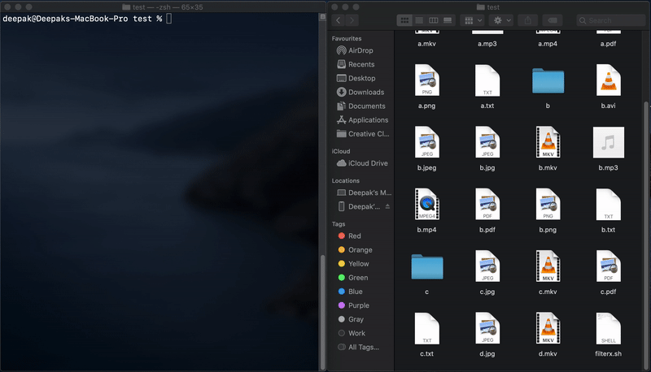

# filterx
A tool to separate and sort files to different folder with respect to extension.



### Usage instructions :
1. Download filterx.sh
2. Give permisssion to the script
```
$ chmod +x filterx.sh
```
3. Check into directory (cd) which you want to filter (Note: Make sure the script is not in the directory where you want to run filterx.)
4. Run the script
```
$ ../filterx.sh # Considering the script is present in parent directory
```
